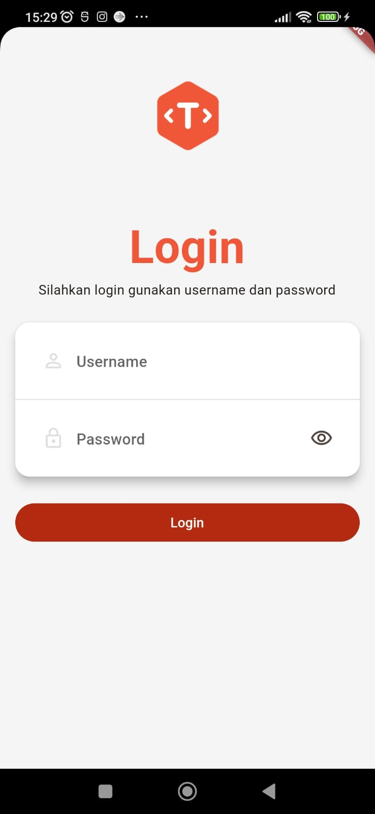
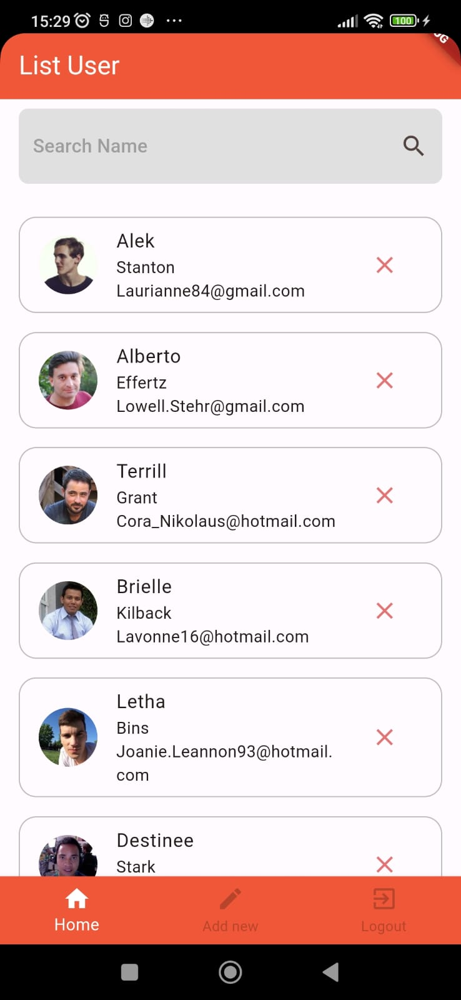
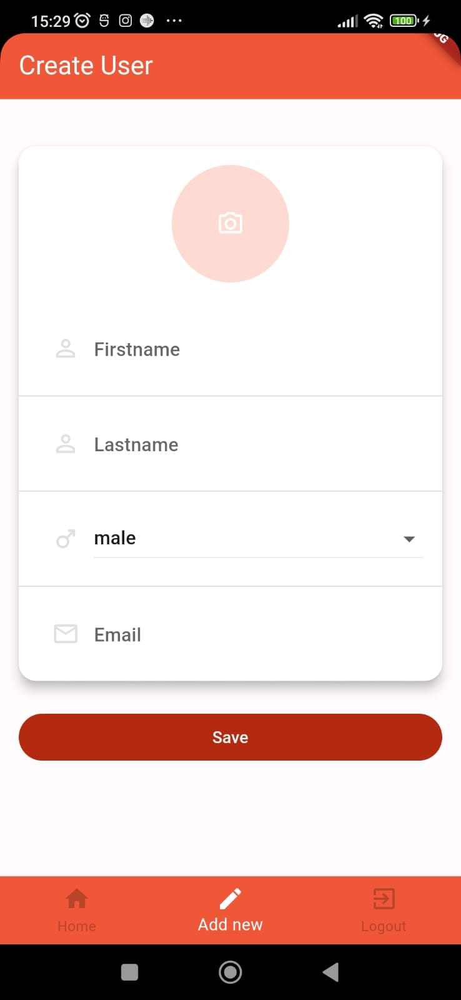

# contact

A new Flutter project who can save email contact

## Getting Started

This project is a starting point for a Flutter application.

### Screenshots:

  
  
  

  
### Pages:
- Login
- Main menu
- List contact
- Add contact

### Tech stack:
- Dio network
- Provider state management
- Material design 3
- Sqflite database
- Shared preference for session
- ImagePicker to take a picture

For help getting started with Flutter development, view the
[online documentation](https://docs.flutter.dev/), which offers tutorials,
samples, guidance on mobile development, and a full API reference.
